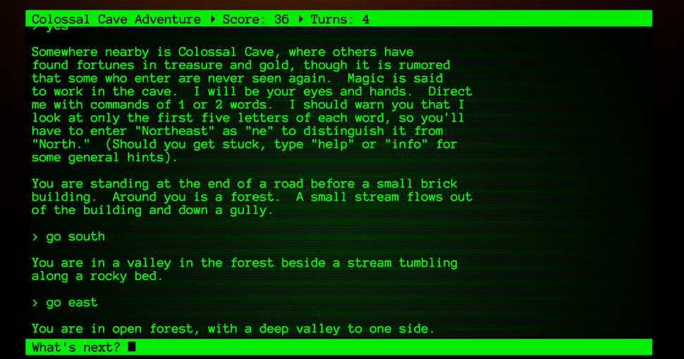
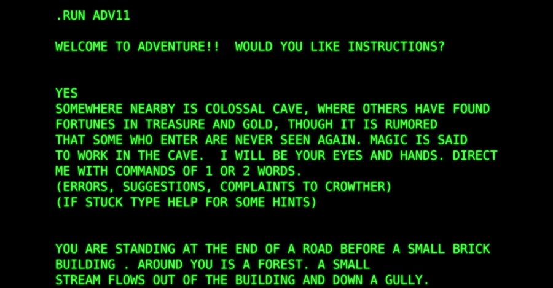

# EOI ADVENT game

Around 1975, Will Crowther, a programmer and an amateur caver, wrote the first text adventure game, Adventure (originally called ADVENT because a filename could only be six characters long in the operating system he was using, and later named Colossal Cave Adventure).





## Instrucciones

- El jugador tiene que estar dispuesto a jugar (preguntárselo).
- Debemos garantizar que el jugador es mayor de 13 años (no queremos que tenga pesadillas 😈)
- Seguidamente tenemos que hacer una introducción de la historia y contexto del juego. (objetivo inicial abrir un cofre) pero no vemos la llave.
- El guión le tiene que permitir llegar hasta la habitación y mirar en la mesa (que es donde está la llave)
- Deberá poder cogerla e ir a la caja para abrir el cofre.
- Fin del juego


## ¿Cómo ejecutarlo?

```shell script
npm install
npm run dev
```
